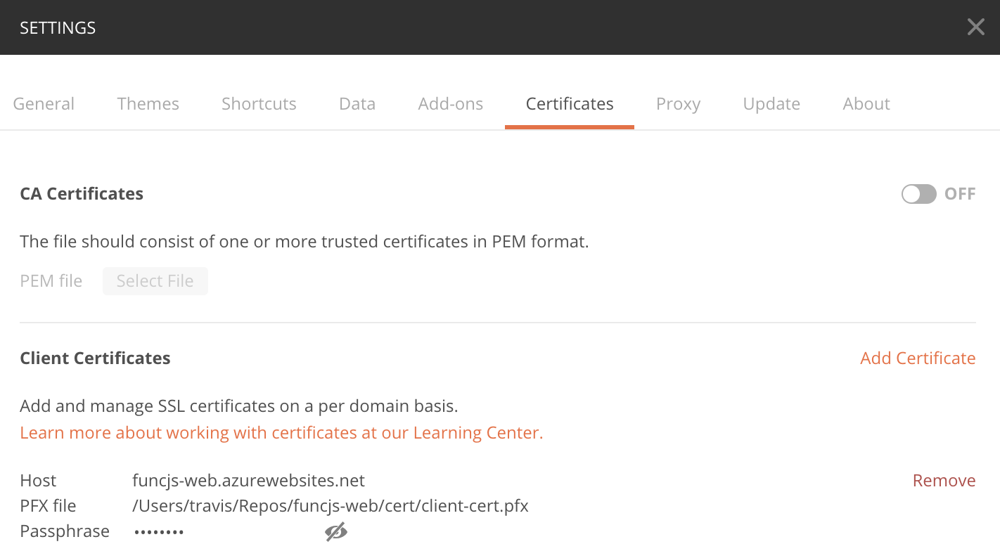
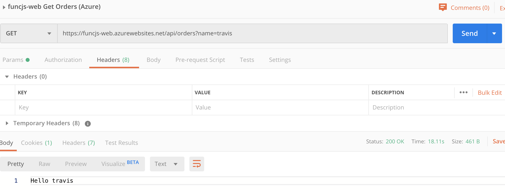

# DEMO: Mutual TLS in Azure Functions

This is a sample Azure function that illustrates how mutual TLS (mTLS) can be used to restrict access to Azure Functions to only trusted infrastructure components such as web proxies. In this sample, Azure API Management (APIM) is used in the role of trusted web proxy.

## Setup

This demo assumes you have a Functions App created and configured for nodejs (version 12). Both your local and Azure enviornemnt should be configured for the Functions version 3 runtime. Clone this repo locally and deploy the Function App using any method of your choice. Once the Function App is deployed, navigate to the **Platform features** section and publish it to APIM via the **API Management** link. Once this is done, we can proceed with configuration of mTLS.

### Create client certificate for APIM

For demonstration purposes, we will be using a self-signed client certificate. If you wish to use the pre-created demo certificate (not for production use), the PFX file password is: `3@6AagBD`. This certificate has the following thumbprint: `E6EAE966BE935167AF3E41273D1636C4DEAC4B90`

To create a new client certificate, run the following commands to create the certificate and then package it into the PFX format. Be sure to document the passwords you set for the .pem and .pfx files as you will need them later when uploading the certificate to APIM.

```bash
openssl req -x509 -newkey rsa:4096 -keyout cert/key.pem -out cert/client-cert.pem -days 730 -subj '/CN=apimanagement'
openssl pkcs12 -export -in cert/client-cert.pem -inkey cert/key.pem -out cert/client-cert.pfx
```

### Configure Azure API Management

In APIM, naviage to **Certificates** and click the **Add** button to upload the .pfx file.

Next, navigate to the published API and set the client certificate in the **Backend** configuration area as shown here: [Configure an API to use a client certificate for gateway authentication](https://docs.microsoft.com/en-us/azure/api-management/api-management-howto-mutual-certificates#-configure-an-api-to-use-a-client-certificate-for-gateway-authentication). APIM will now forward the client certificate for all API calls to the function app when requested.

### Configure the Azure Function App

Complete the following steps in your Function App.

> NOTE: When configuring client certificate authentication, certain areas within the Function App will no longer be visible in the Azure Portal.

In the Function app, configure the following settings:

#### SSL

* HTTPS only: On
* Minimum TLS Version: 1.2

#### Configuration (General settings tab)

* Require incoming certificate: On

#### Configuration (Application settings tab)

The certificate validation is perfomed in the nodejs code and with values provided as environment variables. In the Function App, create the following applicaiton settings. If you are using your own SSL certificate, be sure to replace the below values with yours.

* CERT_ISSUER : `apimanagement`
* CERT_SUBJECT : `apimanagement`
* CERT_THUMBPRINT : `E6EAE966BE935167AF3E41273D1636C4DEAC4B90`
* WEBSITE_NODE_DEFAULT_VERSION : `~12`

For local debugging, you will need to add the same entries to your `local.settings.json` file as shown in this example:


## Testing

Once the Function App is deployed to Azure with the above configuration, you will receive an HTTP 401 UNAUTHORIZED response from App Services unless the client certificate is provided. You can use the following methods to to locally debug certificate validation logic and otherwise test that mTLS is in-place.

### Local (debug)

It is possible to test the certificate authorization logic locally via a client-side tool such as [Postman](https://www.getpostman.com/). To do this, you will need to simulate the certificate forwarding behavior of App Services by including the certificate in the `X-ARR-ClientCert` header. Note this is not true mTLS testing as no mTLS handshake is happening with this technique. However, this approach will provide a way to test or debug backend certificate authorization from within the API locally. For convenience, the encoded demo certificate is provided here:

```
MIIErDCCApQCCQC1KOcIxUfxDDANBgkqhkiG9w0BAQsFADAYMRYwFAYDVQQDDA1hcGltYW5hZ2VtZW50MB4XDTE5MTIxNTAzNDAzNVoXDTIxMTIxNDAzNDAzNVowGDEWMBQGA1UEAwwNYXBpbWFuYWdlbWVudDCCAiIwDQYJKoZIhvcNAQEBBQADggIPADCCAgoCggIBALObqn2oWkwA7Lw15gOu5zwMkp/drhARxZinLKhicyPkdUORCRtNN5aKZ5Tc5OUuM+0MrcM7ML42mlNPIyvy6a62eOFZ2lRW+VugFyye5AYvH6JZeZNW19uN3dqAPQNy8kuAT6WOP61e2u5EeZGZxuXr1X8JuJkWkjqLHZg6NstOkrQOiQg184SAHT0VtGZTrki+IyCRDnNPVZ33wFd+6YMnGb5FUKWGjILRGIblHajcsLCTjb6zMt+MksCHvnHclZ7yzExLwIWqlJHi4f0jA98rX7uOW0LjPXf9w1VNG7M32UyY2WnVb0U4aPwRKwloDWdto1capiL46xbb3TYxZ4abjIWyzqN4q6ypLjXTfiCJ8p6he6bues1ukI5BFdJ+7Hq7gx6RWNKHKLKQCHxAMn0cfo83AnciQZJgbfzBKhjghkR2ooMfDxCRD4J5Tl5HIu8Eav0FNbc5SvuAd6eUa1c8mSayFjLZwZWV2gwZq5YYZErMgiQdmBAVVDFstW4egN5cTRMoijH1IgjnUOztG5oSo9i2nWlVWlNRsoLIEDtmSkxFUcYIQaOkhCd9rNThhFRtXT3F0a7siU6YCJJI+yx18F/qvl8x+x3VliPxG3ldukVaH2bjnNHvhiKKKzYH5kAY2hiHPTE0/9d4FEhAQoYGzSIm/iEtAwadSMvJbTsHAgMBAAEwDQYJKoZIhvcNAQELBQADggIBAE5qkSA7xpbKj1rBb7im/KAO0EXPquUSjyrjqfuzLfIO2WgLigdQ8I0E/gCDu3YdPQbRc8VhDiFL/ry9rGkcFwP3+UaMOP5fgQ5p+YXhRO8x/q1gTdWvEvaxO2eVbBvuJXfgt8Ln+Kb7YKm8Jx6YEdV6aqqqEIW/FliogK9Xb8d9QM0VxCa80mRzdFa3lCSeUBB/rXQXlYFIE6JChBb6x3UT2tFeMIGBhOAAH4JKmlfi2mkCwbykW/k/VQTHJqZAjL4fCaRKm10DwsIiRbIDDeo6cVvn6KmWozjaBh33tlykmOautwWfEZhRTgu82mISqjcWFzZJRQD3fPW5+CaLZ7DR6M1s/3R8KgZ4g0BGJqUTE/1LoKw/WberBSc+owr66DkYee9uubfwa0yvhb9lwM44dYsOS5eBX7hdwrUQlc79oLd1/AjABhhKm6DCTGrp9qNz6ljZwRzOumvi7wOtwH8o/MdkzJz0PtS753/rk44AJ1RdFGGLBDjMeCm1T+i+LqF5ujkHFGgV56douLQgin9KqBdJWxlNhC0A0gPbpkAT+n3Qn2KWLqMyGLpvqM0bHxFhoSya/xsYUkI9FSrUCI7P6tuoqKv4nNtX1QpLYg/qFcylwvuQYoQ97haFZLqC7N4Aa4AJCDm+uEhZ9cwrp8dKkv2R0YPQaWeoFz4vKCxx
```

Start the Function App locally via `func start` or the Visual Studio code debugger and confirm the port the service is listening on. Next, you should be able to invoke the fuction via Postman as shown in this sample:


### Client (Postman)

With the Function App deployed to Azure, you can use Postman to test the API over a true mTLS connection by navigating to **Sertings** > **Certificates** and adding the .pfx file of the client certificate.



Once done, you should be able to call the Function via its App Services URL and without any special headers provided.



### Azure API Management

Testing mTLS between Azure API Management and the Function App is easily accomplished from within the API Management interface in the Azure portal. Simply navigate to the `Test` tab of the published API and you will see a trace of the request-response details.


