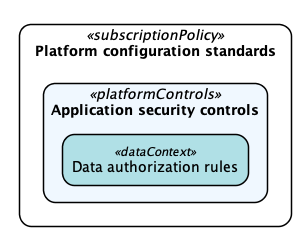
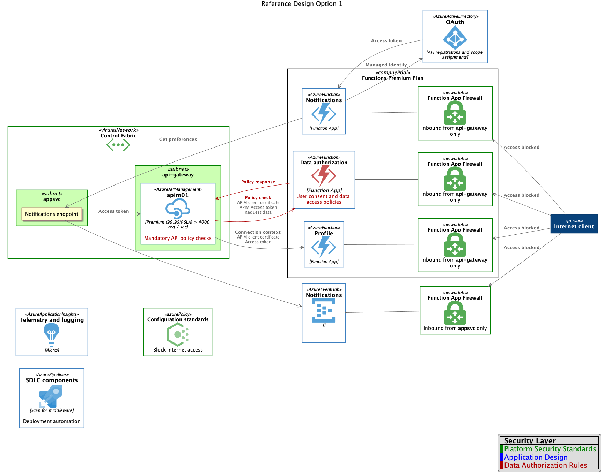

# Microservices Security Patterns for App Service

This repository documents a proposed architecture for implementing a microservices-based design hosted in Azure App Services (Azure Functions). The use-case for this architecture is focused on organizations building "greenfield" (cloud-native) applications that process sensitive data. Sample code and deployment scripts are included to provide an end-to-end demonstration of the security components supporting this design.

## Objectives

The security model behind this architecture is an attempt to reflect the following objectives:

* **Supportabiity** - Avoid introduction of software components that cannot be supported by Microsoft.
* **Productivity** - Bias towards Azure-native services as much as possible to reduce or eliminate administrative burden and security needs introduced by IaaS.
* **Performance and Scalability** - Security layers should not impose significant performance penalties. The solution must support enterprise scalability needs without incerases in complexity.
* **Manageability** - Provide clear separation of responsibility across enterprise teams (ex. developers, DevOps, monitoring and incident response, governance, etc.)

## Conceptual Security Model

From an operational perspectice, the security model is organized into the following three layers:

In the outer layer, *platform configuration standards* represent baseline governance controls that are applied enterprise-wide via policies, regardless of the workload type. These policies enforce settings for most services used by the architecture. The *application security controls* layer represents the architecture and configurations of the application itself and its surroundoing lifecycle activities. For microservices, this could mean adherence to concepts like [Zero Trust Security](https://www.microsoft.com/en-us/security/zero-trust), secure development lifecycle workflows, and aligment to specific threat models. Finally, the *data authorization* layer is responsible for ensuring all operations are executed within a legitimate and approved context. In this layer, factors such as user consent and industry compliance requirements are taken into account.

## Deployment Model

The three layers of the above conceptual security model are realized in Azure through the following architecture components:

| Layer                  | Component                  | Security Capabilities                                                              |
|------------------------|:---------------------------|------------------------------------------------------------------------------------|
| Platform Configuration | Azure Policy               | Enforce Azure SKUs. Mandate VNET injected services and block Internet connectivity |
| Application Security   | App Services > Mutual TLS  | Allow only authenticated network connections. Forward client certificates.         |
| Application Security   | Azure Functions Premium    | HTTP triggers from private VNET w/ access to resources in a private VNET           |
| Application Security   | Application middleware     | Authorize network connection based on client certificate                           |
| Application Security   | Managed Identity           | Authorize API calls via OAuth                                                      |
| Application Security   | Azure API Management       | Centralized data and control plane for microservices                               |
| Application Security   | Application Insights       | Monitor network connections. Customized alerts. Application telemetry.             |
| Data Authorization     | Data authorization service | Custom service for evaluating application API calls                                |

The following diagram illustrates how these compoents interface:

Further documentation and implementation scripts can be found on the following pages:

* [Platform Configuration Standards](docs/1-plat-config-stds.md)
* [Application Security Controls](docs/2-app-sec-controls.md)
* [Data Authorization Rules](docs/3-data-auth-rules)