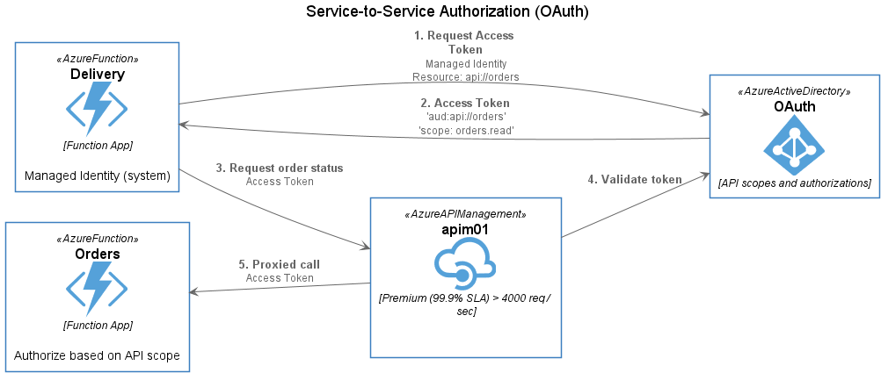

# Application Security Design - Service-to-service authorization

Microservices hosted in Azure Function Apps will be secured using OAuth API scopes, which are defined in Azure Active Directory and granted to Managed Identities (service principals). All inter-service communication flows through Azure API Management (APIM), which takes the responsibility of validating tokens and performing any additional policy checks before forwarding the request to the published API.



This approach allows for centralized, auditable assignment of application roles (scopes) and the use of industry-standard techniques for the enforcement of authorization within APIs. Through the use of APIM as a gateway, supplimental access policy checks can be added without increasing complexity for developers. Furthermore, APIM capabilies such as caching and Application Insights integration can be used to provide additional benefits for observability and performance.

## Configure Service Identities and Permissions

> This section includes steps for configuring API access control, which is managed via Azure Active Directory. The user performing these actions must have these permissions in order to execute the following steps.

Services calling other services must first acquire an access token using its own [Function App Managed Identity (system assigned)](https://docs.microsoft.com/en-us/azure/app-service/overview-managed-identity?tabs=dotnet). It is assumed that both the **orders** and **delivery** Function Apps have been deployed as documented in the [Platform Configuration Standards guide](1-plat-configstds.md).

### Enable Managed Identity and document the 'objectid'

First, enable the System Managed Identity on **delivery** Function App. This can be done via the Azure Portal or via the CLI.

```bash
az functionapp identity assign -g funcdemo -n <function-app-name>
```

Next, you will need to document the Object ID of the service principal linked to the Managed Identity.

```bash
az ad sp list --display-name <function-app-name> --query '[].{name:appDisplayName,objectId:objectId}' -o tsv
```

Save the GUID for the entry that matches the name of your *delivery* Function App.

### Register API, define and assign permissions

In order to establish OAuth-based API security services deployed to the **orders** Function App, it must be registered in Azure Active Directory as an application. To do so, use the following CLI command:

```bash
az ad app create --display-name svc-orders --identifier-uris 'api://svc-orders'
```

Ensure the app has a *service principal* that can be associated to this app. This can be confirmed in portal by looking at the Overivew tab of the app in Azure Active Directory. In the "Managed application in local directory" field, confirm it has a value. If it lists "Create Service Principal", click the link to create it. Document the object ID of the app's associated *service principal* (not the object ID of the app) for use later.

Next, the various permissions the profile service hosts must be defined. This is done by updating the 'appRoles' section of the application manifest for *svc-profile* in the Portal.

```json
{
  "appRoles": [
    {
      "allowedMemberTypes": [
        "Application"
      ],
      "displayName": "Read Orders",
      "id": "a875db13-c9a3-46ed-9eca-423d5e4169cd",
      "isEnabled": true,
      "description": "Allow the application to read order information.",
      "value": "Orders.Read"
    }
  ]
}
```

Finally, execute the following command to link the Managed Identity of the *delivery* Function App to the Orders API.

```powershell
New-AzureADServiceAppRoleAssignment -ObjectId <delivery-sp-objectid> -PrincipalId <delivery-sp-objectid> -Id <orders-approle-id> -ResourceId <orders-app-serviceprincipal-objectid>
```

## Publish Orders API

TBD

## Testing

TBD